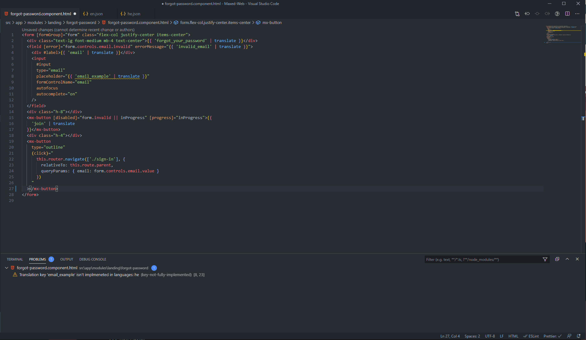
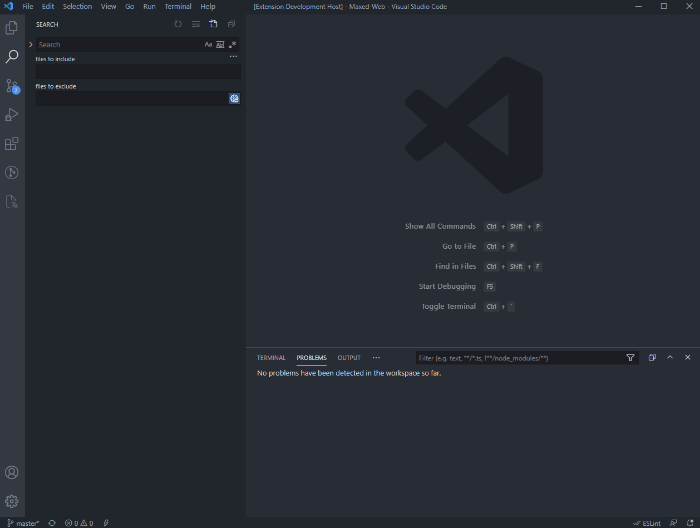
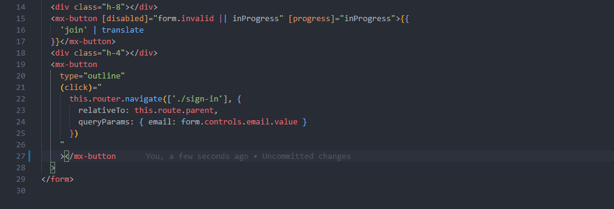

# ngx-translate-intellisense VsCode extension

######Enhance your ngx-translate workflows.

---

##### Table of Contents

- [Requirements](#requirements)
- [Features](#features)
- [Usage](#usage)
  - [Create translations](#createtranslations)
  - [Translations editor](#translationseditor)
  - [Autocomplete translations](#autocompletetranslations)
  - [Diagnose translation problems](#diagnosetranslationproblems)
- [Commands](#commands)
- [Settings](#settings)
- [Known Issues](#knownissues)
- [Pull requests](#pullrequests)
- [Release Notes](#releasenotes)

## Features

- Automatic indexing of translation files
- Easy-to-use translations editor
- Autocomplete for translations
- Translation information when hovering over a translation
- Create translations on the fly
- Catch untranslated or incomplete translations

 

- `NOTE: Autocomplete and creation is only supported in html files`
- `NOTE: This extension only supports json translation file`

## Requirements

- Angular 2 and above
- The [@ngx-translate/core](https://github.com/ngx-translate/core "Open ngx-translate on GitHub") package

## Usage

The extension automatically indexes all translation files. If the above warning continues to appear, or the translation editor is stuck on loading, run the `Update translations` command

### Create translations

- Write the desired text you want translated
- Select it, and execute the `Create translation from selection` command
- A snake_case key will be generated for you, but you can change it to whatever you want
- Press the enter key to confirm the creation
- Open the translation files to see your new translation :)

### Translations editor

- Open the translations view either by using the provided `Translations Editor` activity bar view, or by executing the `Open translations editor` command
  
- The editor displays all your translations in a table, order by `Key` -> `Languages`, and will update automatically when changes to the translation files are made
  - If this is not the case, to fix this issue either click the `Refresh` button or execute the `Update translations` command
- You can now live edit all translation keys and values. `NOTE: empty values wlil be marked in red`
- To create a new entry, click the `+ New` button at the bottom of the table
- To delete a translation, click the `🗑️` button at the end of its row

### Autocomplete translations

- To get translation autocomplete suggestions, type `t:` (all suggestions are prefixed with `t:`)
- Choose the desired value, and the translation pipe will be filled for you

### Diagnose translation problems

The extension currently provides these diagnostics:

|                           | Type    | Description                                                             | Suggested action                                       |
| ------------------------- | ------- | ----------------------------------------------------------------------- | ------------------------------------------------------ |
| key-doesnt-exist          | Error   | The target translation key doesn't exist                                | Create the translation key                             |
| key-not-fully-implemented | Warning | The target translation key isn't implemented in the described languages | Implement the translation key in the missing languages |

## Commands

|                                   | Keybinding                                        | Description                                                                                                                                                                     |
| --------------------------------- | ------------------------------------------------- | ------------------------------------------------------------------------------------------------------------------------------------------------------------------------------- |
| Update translations               | Windows: `Ctrl+T Ctrl+U`   Mac: `Cmd+T Cmd+U` | Updates and indexes all translations                                                                                                                                            |
| Create translation from selection | Windows: `Ctrl+T Ctrl+N`   Mac: `Cmd+T Cmd+N` | Creates a translation from the current text selection.   `NOTE: If the translation already exists, the key won't be created and the translation will be filled in for you` |
| Open translations editor          | Windows: `Ctrl+T Ctrl+E`   Mac: `Cmd+T Cmd+E` | Opens the translation editor in a new tab                                                                                                                                       |
| Open translation files            | Windows: `Ctrl+T Ctrl+O`   Mac: `Cmd+T Cmd+O` | Opens all indexed translation files in new columns                                                                                                                              |

## Settings

Settings are currently not provided

<!-- |                                           | type    | default | description                                     |
| ----------------------------------------- | ------- | ------- | ----------------------------------------------- |
| ng-translate-intellisense.isEnable        | boolean | true    | Toggle the highlight, default is true.          |
| ng-translate-intellisense.isCaseSensitive | boolean | true    | Whether the keywords are case sensitive or not. | -->

## Known Issues

Opening issues is appreciated :)

## Pull requests

All contributions to this project are welcome :)

## Release Notes

######0.0.1 (25/10/2020)

- First release
